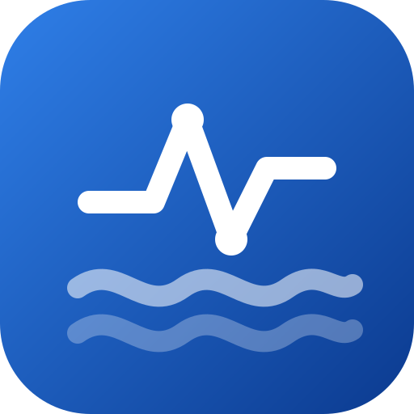
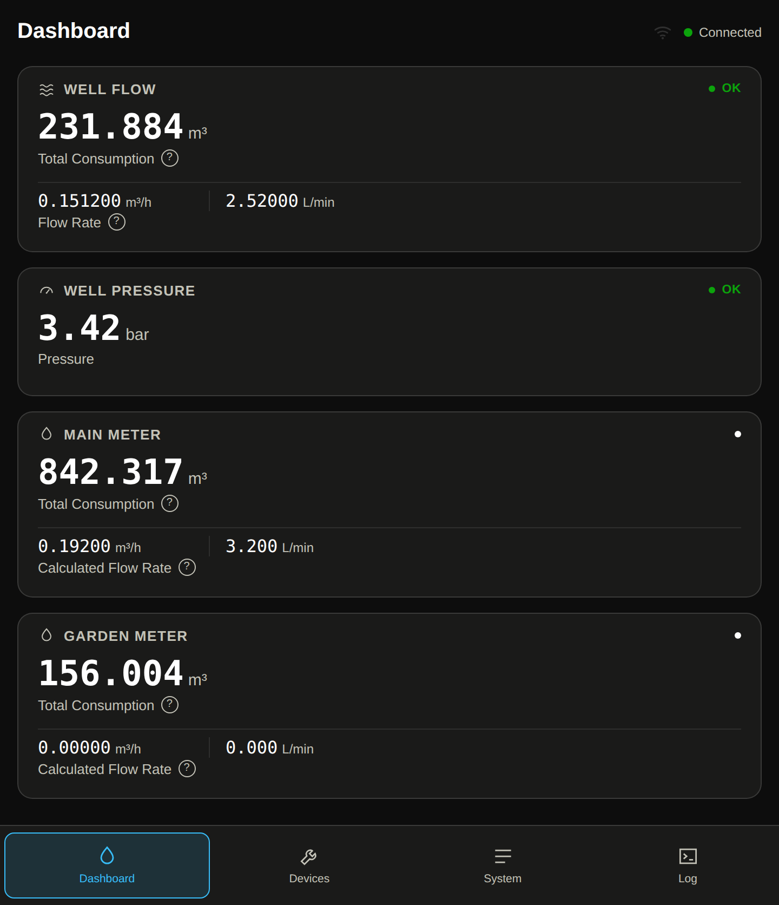
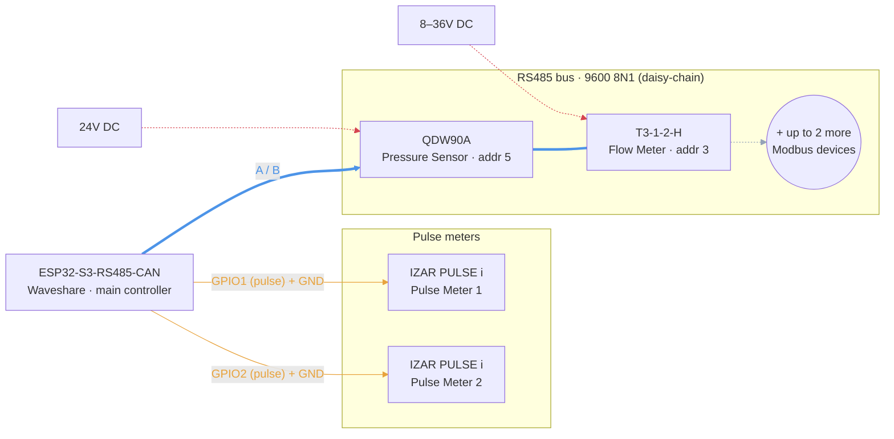
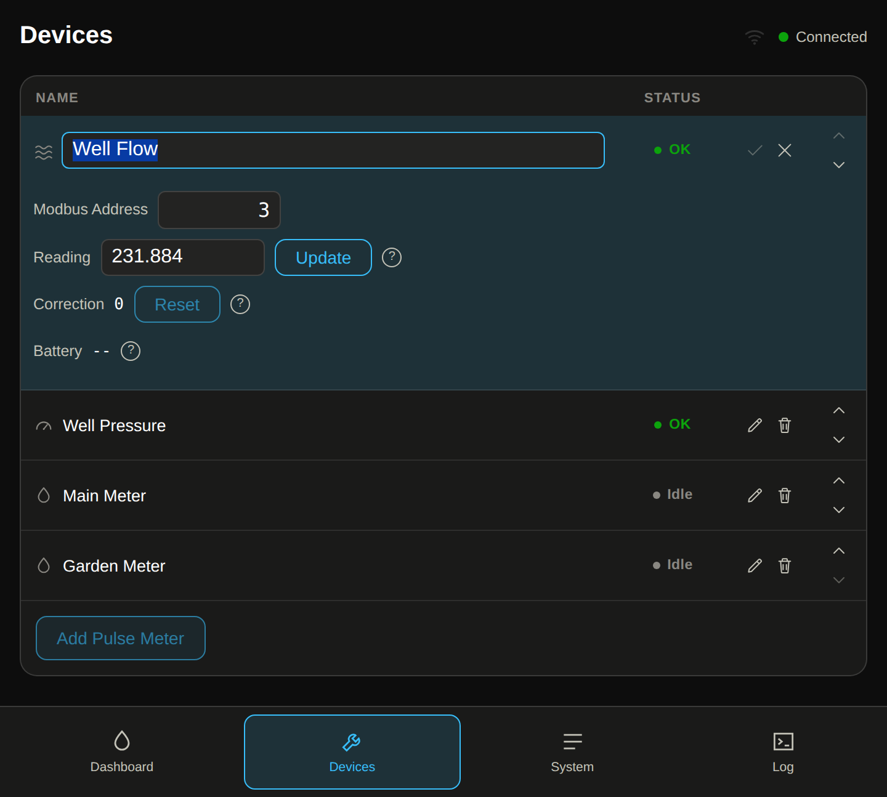

# Water Telemetry Hub

ESPHome firmware + a built-in web dashboard for monitoring a water supply: pulse-type water meters and Modbus RTU (RS485) pressure/flow sensors, all served locally from the device and optionally mirrored into Home Assistant. No cloud, no app — just the device's own IP address in a browser.




## Features

- **2 pulse water meter inputs** — live flow rate (L/min) and total consumption (m³), manual calibration sync.
- **Up to 4 Modbus RTU (RS485) sensor slots** — mix of pressure transmitters and ultrasonic flow meters, auto-detected by type.
- **Bus scan & guided setup** — finds devices on the RS485 bus, flags address collisions/mismatches, and lets you assign/change addresses from the dashboard — no manual Modbus tooling needed.
- **Exact-precision volume tracking** — totals are kept as exact integer millilitres internally, never silently rounded.
- **Self-hosted dashboard** — Dashboard / Devices / System pages, works standalone (no Home Assistant required), installable as a home-screen app on a phone.
- **Home Assistant integration** — optional, via ESPHome's native API, for long-term history and automations.
- **Resilient by design**: Wi-Fi/BLE provisioning on first boot, works through Wi-Fi/HA outages, non-blocking Modbus scheduler so the dashboard stays responsive during a bus scan.

## Hardware

| Part | Used for | Notes | Docs |
|---|---|---|---|
| Waveshare ESP32-S3-RS485-CAN | Main controller | Isolated RS485/CAN, DIN-rail mountable | [Spec](project-docs/docs/hardware/esp32-s3-rs485-can-board.md) · [Datasheet](project-docs/docs/hardware/esp32-s3-rs485-can-board.pdf) |
| IZAR PULSE i (Diehl Metering) | Pulse water meter sensor | Open-collector output, battery-powered (no wiring for power) | [Datasheet](project-docs/docs/hardware/izar-pulse-i-datasheet.pdf) · [Install guide](project-docs/docs/hardware/izar-pulse-i-installation-guide.pdf) |
| QDW90A (RS485/Modbus variant) | Pressure sensor | 0–10 bar, 24V DC | [Modbus reference](project-docs/docs/hardware/qdw90a-modbus-reference.md) · [Datasheet](project-docs/docs/hardware/qdw90a-pressure-transmitter-datasheet.pdf) · [Protocol (mfr.)](project-docs/docs/hardware/qdw90a-modbus-protocol-manufacturer.pdf) |
| T3-1-2-H ultrasonic flow meter | Flow sensor | DN20, RS485/Modbus, 12–30V DC | [Modbus reference](project-docs/docs/hardware/t3-1-2-h-flow-meter.md) · [Quick install](project-docs/docs/hardware/t3-1-2-h-flow-meter-quick-install.pdf) |
| CDEBYTE E810-R14 | RS485 hub | Only needed if wiring the sensors star-topology instead of daisy-chain | [User manual](project-docs/docs/hardware/e810-r1x-rs485-hub-user-manual.pdf) |

Any pulse-output water meter or QDW90A/T3-1-2-H-compatible Modbus device works the same way — these are just the specific parts this project has been tested against.

## Wiring

**Pulse meters** — open-collector output + GND to:

| Meter | Pin |
|---|---|
| Pulse Meter 1 | `GPIO1` |
| Pulse Meter 2 | `GPIO2` |

**RS485 bus** (shared by all Modbus devices):

| Signal | Pin |
|---|---|
| TX | `GPIO17` |
| RX | `GPIO18` |
| Flow control (DE/RE) | `GPIO21` |
| Baud rate | `9600 8N1` |

Wire every Modbus device's `A`/`B` (or equivalent) pair onto this same bus (directly, or via an RS485 hub for a star layout), plus its own power per its datasheet. Pin assignments live in `water-telemetry-hub.yaml`'s `substitutions:` block if you're using a different board.



## Install

1. Install [ESPHome](https://esphome.io/) (`pip install esphome`, or use the ESPHome add-on in Home Assistant).
2. Copy `secrets.yaml.example` to `secrets.yaml` and fill in `api_encryption_key` (generate one: `openssl rand -base64 32`) and `ota_password`. **Wi-Fi credentials are never stored in this repo** — see step 4.
3. Flash the device:
   ```
   esphome run water-telemetry-hub.yaml
   ```
4. **First boot, no Wi-Fi configured yet**: the device starts its own Bluetooth (BLE) provisioning, and also opens a Wi-Fi access point with a captive portal. Connect to either from a phone and enter your home Wi-Fi credentials — they're saved on the device itself, not in this repo.
5. Once connected, open `http://water-telemetry-hub.local` (or the device's IP) in a browser. That's the dashboard.

## Setting up devices

- **Pulse meters**: on the Devices page, press **Add Pulse Meter**, pick which GPIO input it's wired to, give it a name, and press Add.
- **Modbus sensors**: press **Find Modbus Devices** to sweep the RS485 bus for connected devices. Found devices show up with their detected type (Pressure/Flow) pre-filled — name them and press Add. Address conflicts and wiring issues are flagged directly in the table (Collision / Mismatch / Lost), no external Modbus tooling required.
- Everything — display names, addresses, calibration — is editable later from the same table.



## Home Assistant

Add the device from **Settings → Devices & Services → ESPHome** in Home Assistant; it's discovered automatically over mDNS. This is entirely optional — the dashboard above is fully self-contained and keeps working (and keeps measuring) with or without Home Assistant.

## Development

```
./tests/run.sh all         # C++ unit tests, config checks, dashboard e2e tests
esphome config water-telemetry-hub.yaml   # validate the full firmware config
```

See `project-docs/REQUIREMENTS.md` for the full functional/non-functional requirements, and `project-docs/docs/hardware/` for wiring and Modbus register references.

## License

[MIT](LICENSE)
